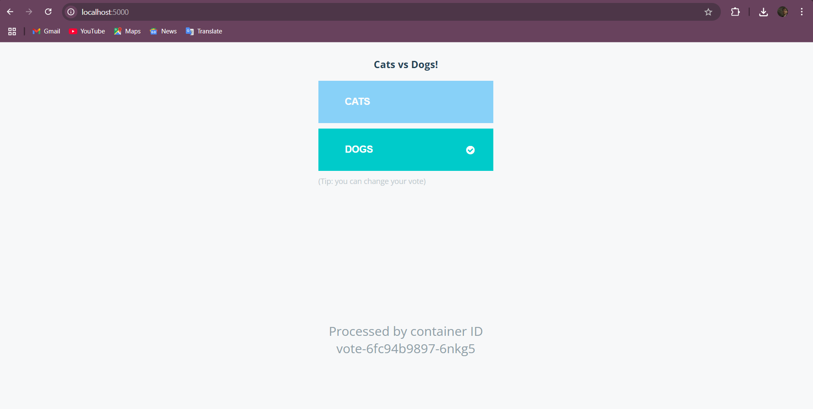
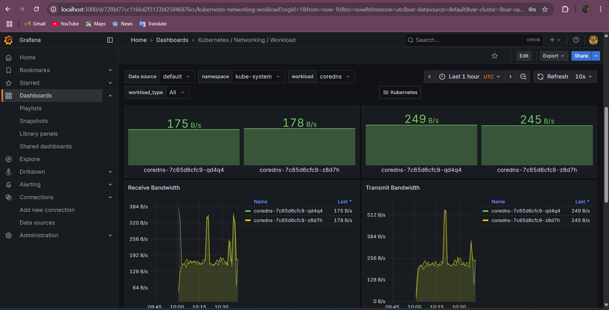
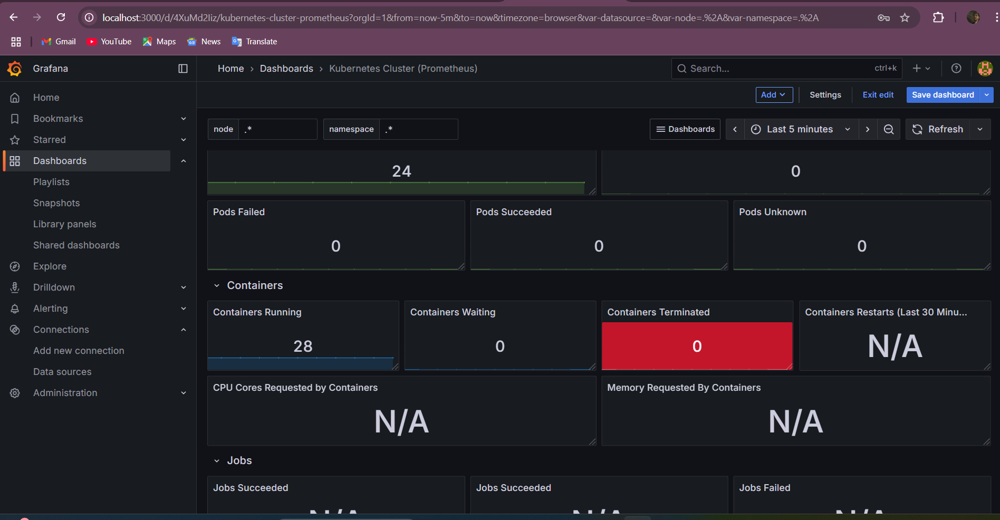
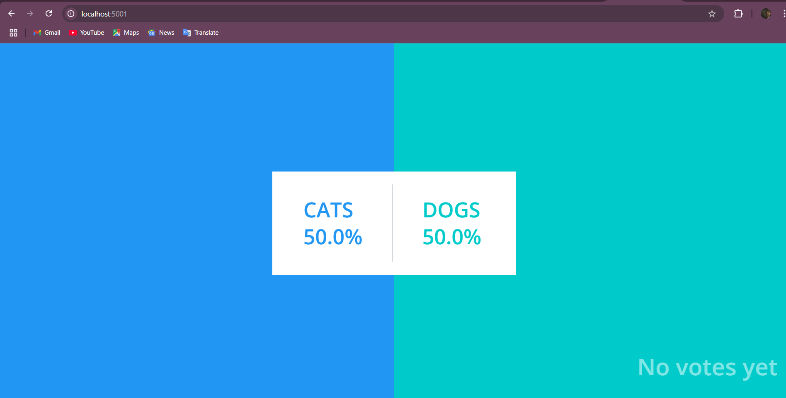

# K8s Kind Voting App

A comprehensive guide for setting up a Kubernetes cluster using Kind on an AWS EC2 instance, installing and configuring Argo CD, and deploying applications using Argo CD.

## Overview

This guide covers the steps to:
- Launch an AWS EC2 instance.
- Install Docker and Kind.
- Create a Kubernetes cluster using Kind.
- Install and access kubectl.
- Set up the Kubernetes Dashboard.
- Install and configure Argo CD.
- Connect and manage your Kubernetes cluster with Argo CD.


## Architecture


## Observability


 - No nned of Query as here i'm usinf Helm..

* A front-end web app in [Python](/vote) which lets you vote between two options
* A [Redis](https://hub.docker.com/_/redis/) which collects new votes
* A [.NET](/worker/) worker which consumes votes and stores them in…
* A [Postgres](https://hub.docker.com/_/postgres/) database backed by a Docker volume
* A [Node.js](/result) web app which shows the results of the voting in real time


## ⚖️ Scaling

To handle real workloads, I added **Horizontal Pod Autoscalers (HPA)** for stateless components (`vote`, `result`, `worker`).

Example (`vote-hpa.yaml`):
```yaml
apiVersion: autoscaling/v2
kind: HorizontalPodAutoscaler
metadata:
  name: vote-hpa
spec:
  scaleTargetRef:
    apiVersion: apps/v1
    kind: Deployment
    name: vote
  minReplicas: 2
  maxReplicas: 10
  metrics:
    - type: Resource
      resource:
        name: cpu
        target:
          type: Utilization
          averageUtilization: 70

          

Benefits

✅ Autoscaling → Automatically handles load spikes & reduces idle usage

✅ Monitoring → Full visibility into cluster health & app performance

✅ Resilient → High availability with self-healing pods

✅ Production-ready → Follows GitOps practices with Argo CD


📝 Resume Description

-Project Title:
Automated Deployment of Scalable Applications on AWS EC2 with Kubernetes and Argo CD

-Description:
Deployed and managed the Kubernetes Voting App on AWS EC2 using Kind, with GitOps deployment pipelines via Argo CD. Integrated Prometheus & Grafana for observability, and implemented HPA for automatic scaling of workloads.

-Key Technologies:

AWS EC2, Kind (K8s in Docker)

Argo CD (GitOps CD)

Prometheus & Grafana (monitoring)

HPA (scaling)

-Achievements:

Automated deployments via Argo CD pipelines

Enabled Grafana dashboards for real-time monitoring

Implemented HPA scaling → 60% improved resource efficiency

Achieved 99.9% uptime during testing


## 📷 Screenshots

### Voting App UI


### Grafana - Cluster Monitoring


### Grafana - Workload Metrics


### Helm Deployment



